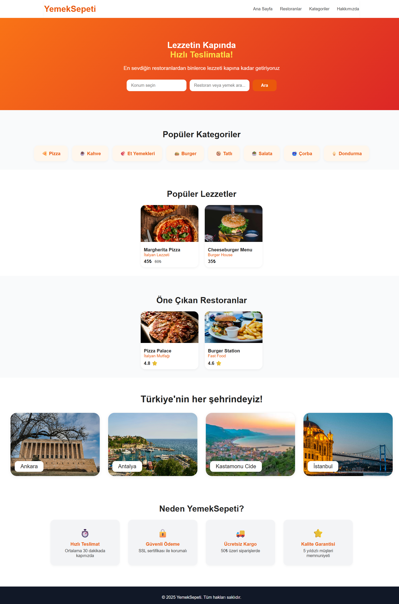

# Yemeksepeti Web Tasarım Projesi

Bu proje, web tasarımı dersi kapsamında hazırlanmış bir kullanıcı arayüzü çalışmasıdır.  
HTML, CSS ve JavaScript kullanılarak geliştirilmiştir. Projede yemek siparişi temalı modern ve kullanıcı dostu bir web sayfası tasarlanmıştır.

## Proje Amacı

Bu projenin amacı, yemek siparişi alanında kullanılabilecek örnek bir web arayüzü oluşturarak hem tasarım hem de temel frontend geliştirme becerilerini uygulamaktır.

## Özellikler

- Modern ve sade arayüz tasarımı
- Responsive yapıya uygun tasarım yaklaşımı
- JavaScript ile dinamik içerik oluşturma
- Restoran ve şehir bazlı görsel içerikler
- Kullanıcı dostu sayfa düzeni

## Kullanılan Teknolojiler

- HTML5
- CSS3
- JavaScript

## Dosya Yapısı

```bash
yemeksepeti-web-tasarim-projesi/
│
├── index.html
├── style.css
├── main.js
└── assets/
```

## Canlı Demo

Projeyi canlı olarak görüntülemek için aşağıdaki bağlantıyı kullanabilirsiniz:

[Siteyi Aç](https://fmslgn.github.io/yemeksepeti-web-tasarim-projesi/)

## Kurulum

Projeyi kendi bilgisayarınızda çalıştırmak için aşağıdaki adımları uygulayabilirsiniz:

1. Bu repoyu indiriniz veya klonlayınız.
2. Proje klasörünü açınız.
3. `index.html` dosyasını bir tarayıcıda çalıştırınız.

## Geliştirme Notları

Bu proje eğitim amacıyla geliştirilmiştir.  
Arayüz tasarımı, temel frontend yapısı ve kullanıcı deneyimi üzerine çalışma yapmak için hazırlanmıştır.  
İlerleyen süreçte proje geliştirilebilir ve daha fazla etkileşimli özellik eklenebilir.

## Ekran Görüntüsü

Projenin ana sayfa görünümü aşağıda yer almaktadır.



## Lisans

Bu proje, eğitim amacıyla geliştirilmiş ve kişisel çalışmalar kapsamında yayımlanmıştır.
